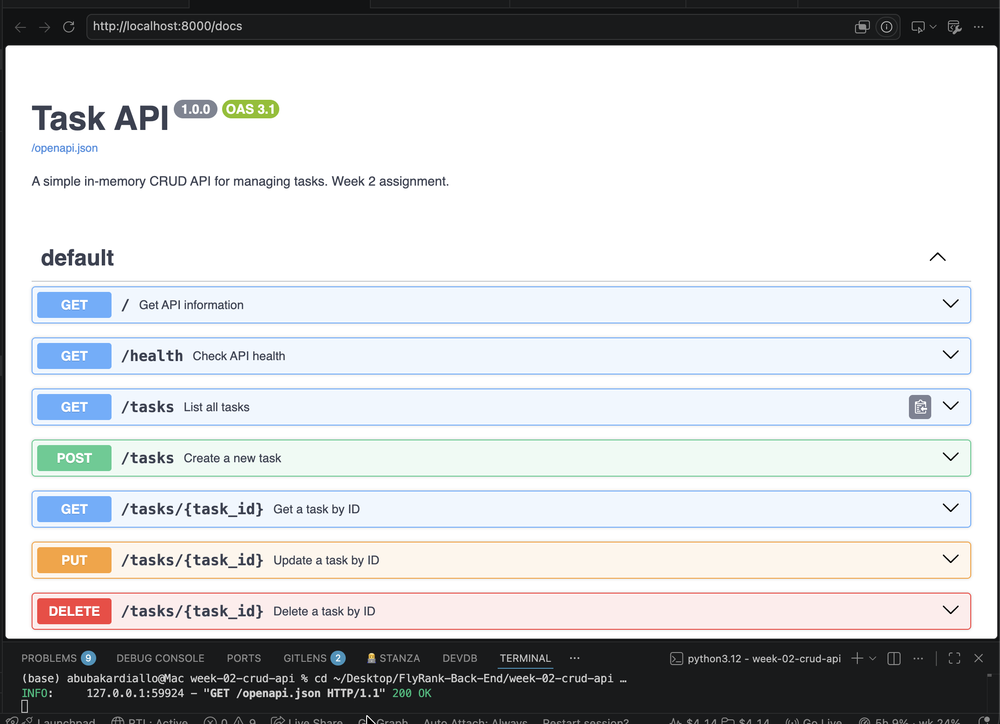

# Week 2 — Task API (CRUD)

A small REST API for managing a to-do list, built with **Python + FastAPI**.
Supports the four CRUD operations over an **in-memory** list — no database, no files.

Interactive docs (Swagger UI) are served at `/docs`.

## Install & run

```bash
cd week-02-crud-api
python3 -m venv .venv
.venv/bin/pip install -r requirements.txt
.venv/bin/uvicorn main:app --reload
```

Server starts at <http://localhost:8000>. Swagger UI: <http://localhost:8000/docs>.

## Endpoints

| Method | Path | Purpose | Success | Errors |
|--------|------|---------|---------|--------|
| GET | `/` | API info | 200 | — |
| GET | `/health` | Health check | 200 | — |
| GET | `/tasks` | List all tasks | 200 | — |
| GET | `/tasks/{task_id}` | Get one task | 200 | 404 unknown id |
| POST | `/tasks` | Create a task | 201 | 400 missing/empty title |
| PUT | `/tasks/{task_id}` | Update a task | 200 | 400 empty title · 404 unknown id |
| DELETE | `/tasks/{task_id}` | Delete a task | 204 | 404 unknown id |

### Task shape

```json
{ "id": 1, "title": "Learn FastAPI", "description": "This is task 1", "done": false }
```

`id` and `done` are set by the server — the client never sends them on create.

### Validation rules

- `POST /tasks` requires a non-empty `title`. Missing field, `""`, or `"   "` all return **400**.
- `PUT /tasks/{id}` accepts any subset of `title`, `description`, `done`. Omitted fields are left
  unchanged; a `title` that is present but blank returns **400**.

## Example request

```
$ curl -i -X POST http://localhost:8000/tasks \
    -H "Content-Type: application/json" \
    -d '{"title":"Buy milk"}'
HTTP/1.1 201 Created
date: Tue, 21 Jul 2026 08:11:15 GMT
server: uvicorn
content-length: 57
content-type: application/json

{"id":4,"title":"Buy milk","description":"","done":false}
```

## Swagger UI



Every endpoint can be exercised from this page with "Try it out" — the full
create → read → update → delete cycle works without touching a terminal.

## The mortality experiment

Create a few tasks, restart the server, then `GET /tasks`: the new tasks are gone and the
original three are back. The task list is a plain Python list living in the process's memory,
so it dies with the process and is rebuilt from the literal in `main.py` on every start.

That is exactly the problem a database solves — storage that outlives the program that wrote it.
