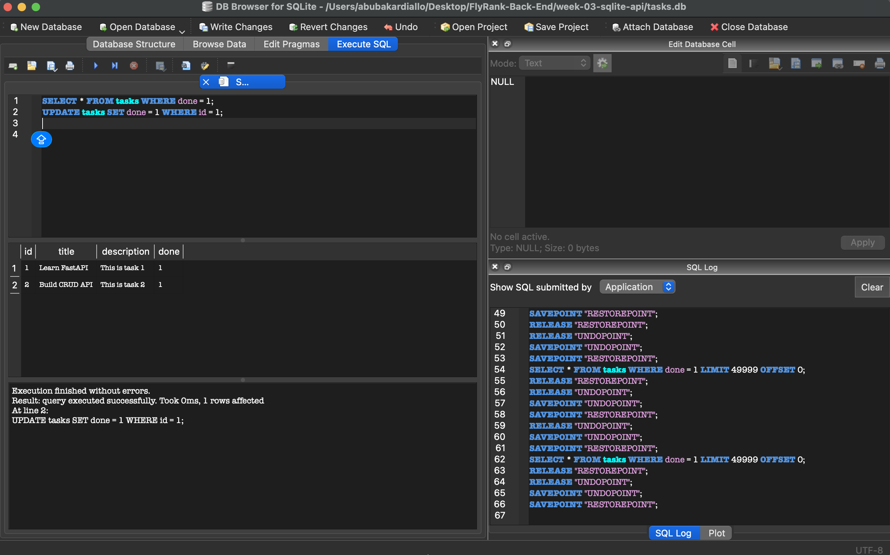

# Week 3 — Task API (SQLite)

The same CRUD API from Week 2, with its storage moved from an in-memory list to a real
**SQLite** database. The endpoints and their request/response shapes are unchanged — only
the storage layer underneath swapped from memory to disk. **Now the data survives a restart.**

Built with **Python + FastAPI + `sqlite3`** (standard library). Swagger UI at `/docs`.

## Why SQLite?

- **Single file** — the whole database is one file, `tasks.db`. No server to run.
- **Zero setup** — `sqlite3` ships with Python; nothing to install, no credentials.
- **Survives restarts** — data lives on disk, so it's still there when the server stops.

## Where the database lives

`tasks.db`, created automatically next to `main.py` on first run. It is **git-ignored**, so
every clone starts fresh: the table is created and three example tasks are seeded on first boot.

## Install & run

```bash
cd week-03-sqlite-api
python3 -m venv .venv
.venv/bin/pip install -r requirements.txt
.venv/bin/uvicorn main:app --reload
```

Server starts at <http://localhost:8000>. Swagger UI: <http://localhost:8000/docs>.

On first run `main.py` creates `tasks.db`, creates the `tasks` table if missing, and seeds
three tasks **only if the table is empty** — so restarts never duplicate them.

## Endpoints

| Method | Path | Purpose | Success | Errors |
|--------|------|---------|---------|--------|
| GET | `/tasks` | List all tasks | 200 | — |
| GET | `/tasks/{id}` | Get one task | 200 | 404 unknown id |
| POST | `/tasks` | Create a task | 201 | 400 missing/empty title |
| PUT | `/tasks/{id}` | Update a task | 200 | 400 empty title · 404 unknown id |
| DELETE | `/tasks/{id}` | Delete a task | 204 | 404 unknown id |

Task shape: `{ "id": 1, "title": "Learn FastAPI", "description": "This is task 1", "done": false }`

All queries use **parameterized placeholders** (`?`) — no user input is ever glued into SQL.

## Example SQL (Stage 4, run by hand in DB Browser)

```sql
SELECT * FROM tasks WHERE done = 1;   -- only completed tasks
```

Returned the one seeded task whose `done` is `1` ("Build CRUD API"). Running it in DB Browser
and then calling `GET /tasks` shows the same data — the API and DB Browser read the one same
file, `tasks.db`. There is no syncing; there is one source of truth.

## Database screenshot



> _TODO: open `tasks.db` in DB Browser for SQLite, screenshot the `tasks` table, save it to
> `docs/db-browser.png`._

## AI vs me (Stage 6)

The full prompt is in [`ai-version/PROMPTS.md`](ai-version/PROMPTS.md). The AI's code is
quarantined in `ai-version/` and is **not** the submission — the hand-built version at the
project root is. Diff: `git diff --no-index main.py ai-version/main.py`.

**What the AI did better:** its code is shorter and it commits explicitly after every write.
Its per-endpoint logic is easy to read.

**What it got wrong / quietly ignored:**
1. **Dropped the `description` column** — the prompt never named it, so the AI silently
   changed the task shape to `{id, title, done}`. A client relying on `description` breaks.
2. **One shared module-level connection** (`check_same_thread=False`) instead of a connection
   per request — convenient, but riskier under concurrency.
3. **404 message changed** to `"Task not found"` instead of the A1 `"Task {id} not found"`.

**What my prompt forgot to specify — and what the AI decided for me:** I never said "keep the
`description` field" or "seed inside a transaction," so the AI dropped the column and seeded with
three separate inserts. The rematch (round 2) added those two sentences and the output matched
my hand-built version. **Lesson: the AI's output is exactly as good as the specification.**
