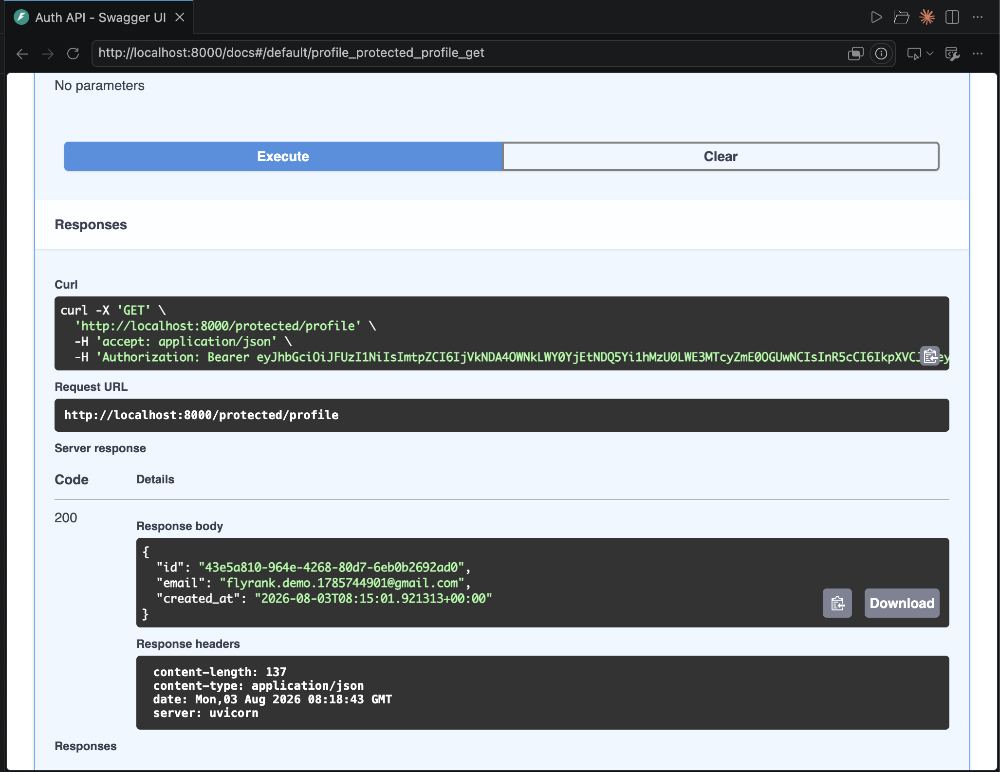

# Week 4 · A4 — Auth: Login & Protect

A secure API using **Supabase Auth**. Users sign up, log in, and log out; the server
verifies the **JWT** Supabase issues and guards protected routes behind one reusable
dependency. Built with **Python + FastAPI**.

**We never store a password or hash anything ourselves** — Supabase is the Identity
Provider. This code only sends credentials to Supabase and verifies the tokens it returns.

## Setup

1. Create a free project at [supabase.com](https://supabase.com).
2. **Project Settings → API**: copy the **Project URL** and the **anon (public)** key
   (never the `service_role` key).
3. **Authentication → Sign In / Providers → Email**: turn **Confirm email OFF** so a fresh
   signup can log in immediately. (Leave it on in production.)
4. Copy the secrets into `.env` (git-ignored — a committed [`.env.example`](.env.example)
   lists the names):

   ```
   SUPABASE_URL=https://your-ref.supabase.co
   SUPABASE_KEY=your_anon_public_key
   ```

## Run

```bash
cd week-04-supabase-auth
python3 -m venv .venv
.venv/bin/pip install -r requirements.txt
.venv/bin/uvicorn app.main:app --reload
```

Server at <http://localhost:8000>. Interactive Swagger UI: <http://localhost:8000/docs>.

## API reference

| Method | Path | Purpose | Auth | Success | Errors |
|--------|------|---------|------|---------|--------|
| POST | `/auth/signup` | Create a user account | none | 201 | 400 missing fields |
| POST | `/auth/login` | Authenticate, return a JWT | none | 200 | 400 · 401 bad creds |
| POST | `/auth/logout` | End the session | Bearer | 204 | 401 |
| GET | `/public/info` | Public, open data | none | 200 | — |
| GET | `/protected/profile` | Private profile | Bearer | 200 | 401 no/invalid token |
| GET | `/protected/dashboard` | Second protected route (same guard) | Bearer | 200 | 401 |

Send the token as `Authorization: Bearer <access_token>`.

## The guard (one function, every locked door)

Token verification lives once in [`app/auth.py`](app/auth.py) as a FastAPI dependency
(`get_current_user`). It pulls the bearer token, calls `supabase.auth.get_user(token)` —
a real network check with Supabase — and returns the user or raises 401. Both
`/protected/profile` and `/protected/dashboard` reuse it with zero new auth code. That
reuse is the point: add `Depends(get_current_user)` to any route to protect it.

## Swagger authorization

FastAPI's `HTTPBearer` scheme puts an **Authorize** padlock on `/docs`. Click it, paste a
JWT from `/auth/login`, and call the protected endpoints straight from the browser.



> _TODO: screenshot <http://localhost:8000/docs> showing the padlock, save to `docs/swagger.png`._

## Security notes

- `.env` is git-ignored and was never committed. Only `.env.example` (placeholders) is in git.
- The **anon** key is designed to be public (client-side safe); the `service_role` key is not
  used anywhere in this project.
